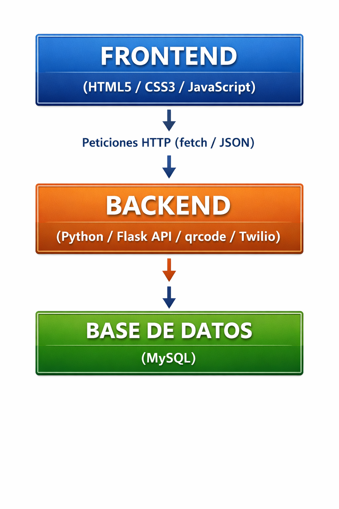

# Fitpass AI 🚀
### Sistema de Control de Accesos y Retención con Inteligencia Artificial

Este es el proyecto de software para el gimnasio **Sport Fitness**

##  Objetivo del Negocio
Reemplazar los recibos de papel por un sistema automatizado e inteligente que genera códigos QR dinámicos, los envía automáticamente por WhatsApp y gestiona la retención de clientes mediante alertas automatizadas con IA.

##  Tecnologías Usadas en esta Fase (hasta el momento)
- **Backend:** Python 3 con el Framework Flask
- **

## 📐 Arquitectura del Sistema
Aquí se muestra el mapa visual de cómo interactúa nuestra interfaz con la API de Flask:

